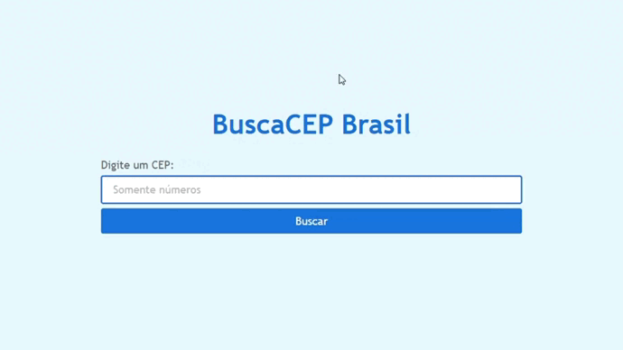

# Projeto | BuscaCEP Brasil

### Desenvolvido como projeto de estudo

### Focos de estudo: React com consumo de API

Confira o resultado [clicando aqui](https://buscacep-react.netlify.app/) (Dica: control + click para abrir o link em uma nova guia. 😉)

# Preview do projeto

# Techs usadas no desenvolvimento

- React
- JSX
- HTML
- CSS modules
- Git

# Desenvolvido por

- [@jeanwisotscki](https://github.com/jeanwisotscki/)
